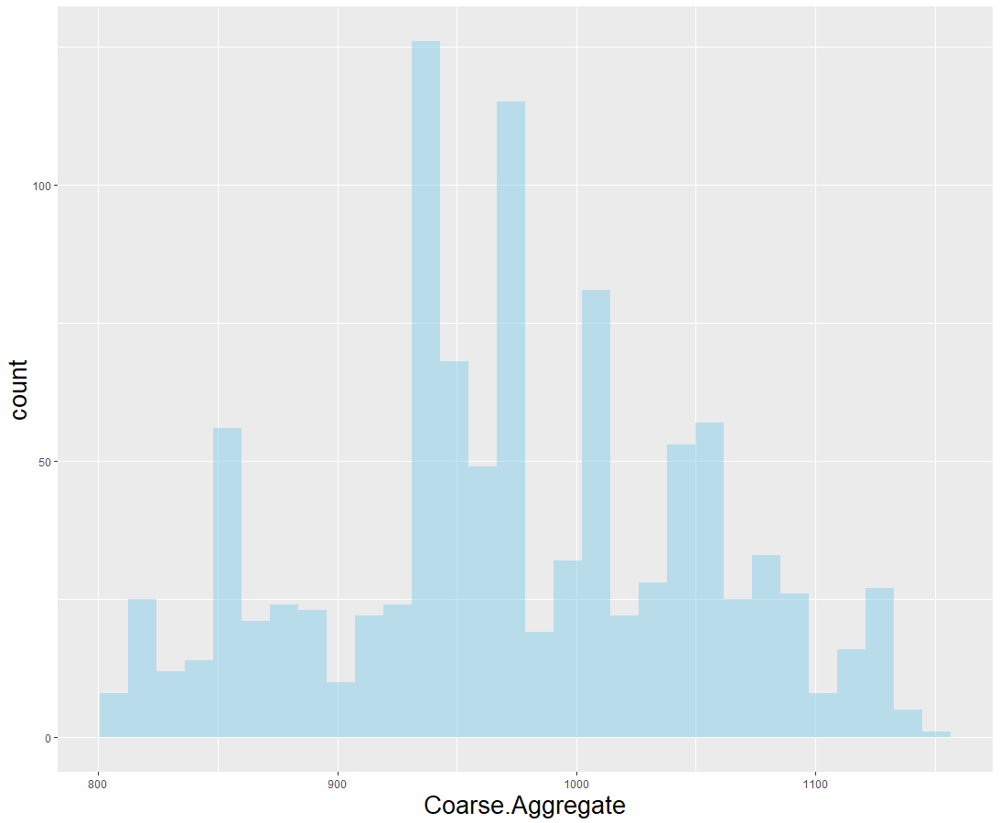
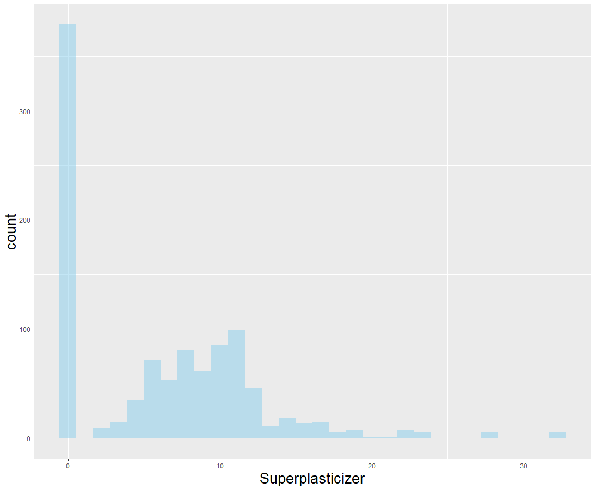

**Concrete data**

1. 데이터 소개	
   많은 연구들을 통해 콘크리트의 강도는 물과 시멘트의 혼합비율뿐만 아니라, 그 외 다양한 콘크리트 성분에 영향을 받는다고 알려져 있다. 본 데이터는 반응변수인 콘크리트 압축 강도와 이 콘크리트의 성분을 포함한 8가지 독립변수로 이루어져 있다. 이 데이터를 이용하여 콘크리트 압축 강도에 대한 예측 모델을 만들고, 중요한 변수에 대해 알아보고자 한다.

   데이터 차원 : 1030 \* 9
1. 변수 소개

|변수명|설명|단위|
| :-: | :-: | :-: |
|Cement|시멘트의 양|kg / m3|
|Blast Furnace Slag|용광로슬래그|kg / m3|
|Fly Ash|폐가스 중에 포함되는 석탄재|kg / m3|
|Water|물 량|kg / m3|
|Superplasticizer|고농축 수분 감소제|kg / m3|
|Coarse Aggregate|거친 골재|kg / m3|
|Fine Aggregate|매끄러운 골재|kg / m3|
|Age|기간|day|
|Concrete compressive strength|콘크리트 압축 강도|MPa|

1. 데이터 탐색
   8개의 독립변수는 모두 연속형 변수이다. 각 변수에 대해 단변량 분포를 살펴보면 아래 그림1 과 같다.

{: width="250", height="250}            {: width="250", height="250}

{: width="250", height="250}             {: width="250", height="250}

{: width="250", height="250}             {: width="250", height="250}

{: width="250", height="250}             {: width="250", height="250}

그림 1. 독립변수 히스토그램

그림1 의 좌측 4개의 그래프를 보면 들쭉날쭉함이 있지만 대체로 종모양의 분포를 보여주고 있다. 우측 4개 그래프의 경우, 왼편으로 치우쳐 있으며 다봉형의 분포를 보여준다. 또한 간헐적으로 관측값이 없는 구간이 존재한다. 이 같은 특징을 파악하기 위해서는 콘크리트 제조 공정에 대한 도메인 지식이 있어야 한다.

다음의 그림2 는 반응변수와 독립변수간의 산점도 중 특징이 보이는 두 개의 그래프다.

 

그림2. 독립변수와 반응변수의 산점도

시멘트의 양과 고농축 수분 감소제의 양이 증가할수록 콘크리트 압축강도가 증가하는 형태를 보인다. 이외 다른 변수들의 산점도에서는 큰 특징을 찾기 어려웠다.

1. 교호작용 

앞서 데이터소개 부분에서 언급했듯이 많은 연구를 통해 콘크리트의 강도는 물과 시멘트 이외의 성분에도 많은 영향을 받는다고 알려져 있다. 이 사실을 고려해보면 변수들 간의 유의한 교호작용이 존재할 수 있다. 따라서 의사결정나무를 통해 교호작용을 파악해 보았고, 그 결과는 아래 그림3과 같다.

그림3. 의사결정나무 결과

의사결정나무 적합 결과 최대 5~6차의 교호작용을 고려해볼 수 있으나, 고차 교호작용의 경우 변수의 의미를 이해하기 어렵다. 그렇기 때문에 2차 교호작용까지만을 고려하여 분석을 진행했다. 즉, Age와 Cement 변수의 교호작용을 모형에 추가하여 분석을 진행하였다. 

1. 모형적합
1) 회귀모형

반응변수를 정규분포로 가정하고 회귀모형을 적합해 보았다. 

|변수|계수|변수|계수|
| :-: | :-: | :-: | :-: |
|(Intercept)|-2.125e+01|Superplasticizer|3.621e-01|
|Cement|1.239e-01|Coarse.Aggregate|2.012e-02|
|Blast.Furnace.Slag|9.742e-02|Fine.Aggregate|1.402e-02|
|Fly.Ash|7.842e-02|Age|1.868e-01|
|Water|-1.526e-01|Cement:Age|-2.250e-04|
표1. 회귀분석 결과 회귀계수

적합 결과 P-value를 통해 Coarse.Aggregate와 Fine.Aggregate를 제외하고 모두 유의한 것을 알 수 있었다. 이후, Backward Elimination 기법을 통해 변수선택을 실시하였고, Fine.Aggregate à Coarse.Aggregate 순서로 모형에서 제거 되었다. 결과는 아래 표2 와 같다.

|변수|계수|변수|계수|
| :-: | :-: | :-: | :-: |
|(Intercept)|2.604e+01|Superplasticizer|2.678e-01|
|Cement|1.135e-01|Coarse.Aggregate|x|
|Blast.Furnace.Slag|8.341e-02|Fine.Aggregate|x|
|Fly.Ash|6.460e-02|Age|1.866e-01|
|Water|-2.158e-01|Cement:Age|-2.261e-04|
표2. Backward Elimination 후 회귀분석 결과 회귀계수

1) Random Forest

다음으로 Random Forest를 적합했다. Tuning parameter 중 subsampling의 수는 300번으로 고정해 두었고, 변수의 개수는 grid search를 통해 튜닝하였다. 적합 후 변수중요도는 아래 그림 4 와 같다. 추가한 교호작용이 가장 중요함을 알 수 있었다.

그림4 Random Forest 변수중요도

1) Deep neural network

회귀분석과 Random Forest의 test RMSE를 비교했을 때, RF의 성능이 많이 좋다는 것을 알 수 있었다. 이를 통해 비선형적인 특징이 중요할 수 있다는 직관을 얻었고, 이에 따라 딥러닝 모형을 적합해 보았다. DNN 적합 결과 변수중요도는 아래 그림5 와 같다.

그림5. DNN 변수중요도

이 모형에서 활성화 함수는 relu함수를 사용했으며, 은닉층이 3개인 네트워크로 구축했다. 은닉노드의 수와 epoch수 그리고 dropout rate의 경우 과적합이 발생하지 않으면서 성능을 높이는 방향으로 grid search하였다.

1. 분석결과

회귀모형, Random Forest 그리고 DNN 모형을 적합해 보았고, 이 3가지 모형의 test 성능평가는 RMSE로 하였다. 결과는 다음과 같다.

|모형|LM|변수선택 LM|RF|DNN|
| :-: | :-: | :-: | :-: | :-: |
|Test RMSE|9.782756|9.751202|5.331047|5.615425|

