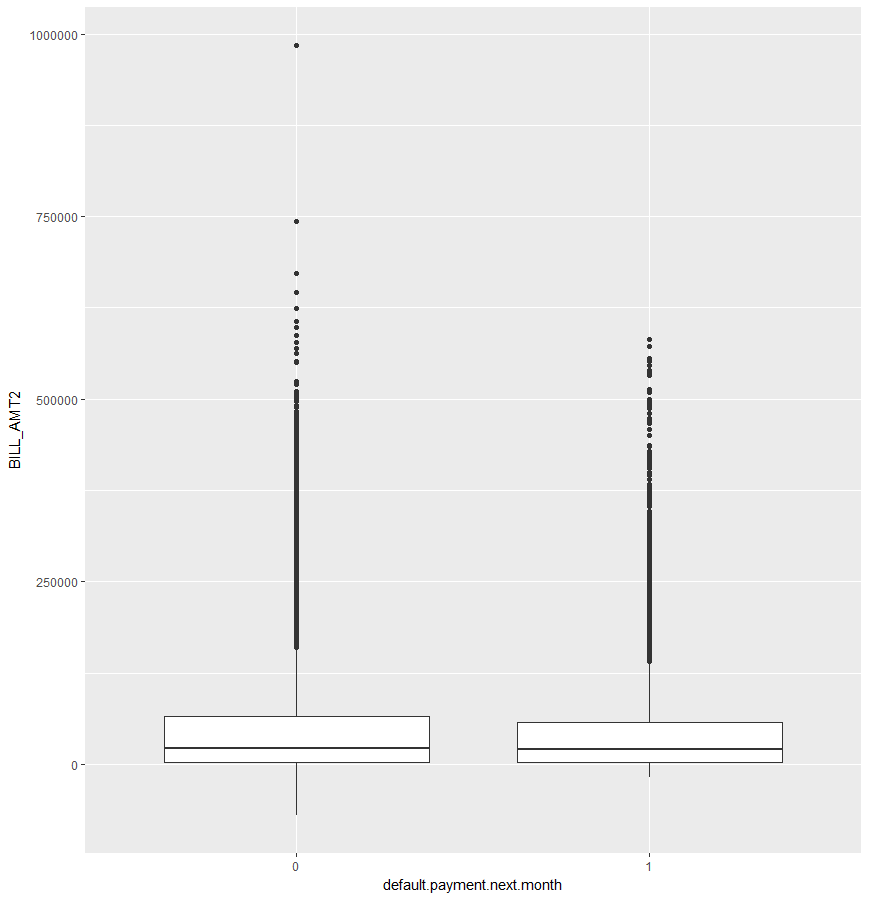

# Credit card data Analysis

## 1. 데이터 소개

국내 금융기관에는 수익성 지표로 MEL(Maturity Expected Loss)이 있다. 이 지표는 Probability of Default(PD), Loss Given Default(LGD) 그리고 Exposure at Default(EaD)의 곱으로 계산된다. 본 데이터는 이 중 PD에 관한 자료로써, 카드사의 고객이 다음달 대금을 연체할지에 대해 이항분류를 목적으로 한다. 이 같은 자료를 분석할 때 흔히 마주하게 되는 문제는 	반응변수의 두 범주가 굉장히 불균형을 이루는 문제이다. 따라서 이 보고서에서는 imbalanced data에 적용해볼 수 있는 표본추출 방법에 따른 성능 비교를 해보고자 한다.

## 2. 변수소개

|변수명|설명|
| :-: | :-: |
|X1|Amount of the given credit|
|X2|Gender (1 = male; 2 = female)|
|X3|Education (1 = graduate school; 2 = university; 3 = high school; 4 = others)|
|X4|Marital status (1 = married; 2 = single; 3 = others)|
|X5|Age|
|X6|the repayment status in September, 2005|
|X7|the repayment status in August, 2005|
|X11|the repayment status in April, 2005|
|X12|amount of bill statement in September, 2005|
|X13|amount of bill statement in August, 2005|
|X17|amount of bill statement in April, 2005|
|X18|amount paid in September, 2005|
|X19|amount paid in August, 2005|
|X23|amount paid in April, 2005|
|Y|default payment next month (Yes = 1, No = 0)|

## 3. 데이터 탐색

우선 설명변수가 독립변수인 경우의 반응변수와의 모자이크 그래프는 아래와 같다.

 

그림1. 범주형 변수 모자이크 플롯

성별과 결혼여부에 대한 설명변수의 모자이크 플롯에서는 큰 특징을 찾기 어려웠지만, 그림1 의 교육수준과 과거연체대금납부 이력에 대한 모자이크 플롯에서는 범주에 따라 반응변수에 주는 영향에 차이가 있다는 것을 알 수 있었다. 이와 유사한 변수들이 많고, 이 변수들의 범주 역시 많기 때문에 범주 통합이 필요해 보인다.

설명변수가 연속형 변수인 경우 그림2 와 같이 큰 특징을 보이는 변수가 존재하지 않았다.

 

그림2. 연속형 변수 박스플롯

## 3. 범주 통합

앞서 모자이크 플롯에서 보았듯, 일부 범주형 설명변수에서 범주통합이 필요해 보인다. 본 절에서는 이 분석에서 활용된 범주 통합 방법에 대해 소개하고자 한다. 

우선 범주를 통합할 설명변수를 선정하고, 해당 변수만으로 로지스틱 회귀분석을 한다. 그 결과로 산출된 각 범주의 p-value를 확인하고, 유의하지 않은 범주를 기준이 되는 범주에 통합하는 방법으로 진행된다. 이 과정은 모든 범주가 유의할 때까지 반복된다. 아래 그림3 은 2005년 9월 당시 카드대금 지불상태 변수에 대한 예시이다. 이 설명변수는 -2부터 8까지 총 11개의 범주로 이루어져 있다. 해당 변수의 특징으로는 범주 1부터 8까지는 1달 연체부터 8달 연체까지 순서형 범주이지만, 기준이 되는 범주인 -2의 경우 연체대금도 없고 해당기간 거래이력도 없음을 의미한다. 순서형 범주를 통합할 때는 인접한 범주로 통합하는 것이 원칙이지만, 이 자료의 경우 기준이 되는 범주가 순서와는 관련이 없으므로 순서를 고려하지 않고 범주통합을 진행했다. 이 변수의 경우 범주 0과 7이 범주 -2로 통합이 되었다. 

 

그림 3. PAY\_0 설명변수의 범주 통합 전(좌측)과 범주 통합 후(우측)

## 4. 자료 분석

본 자료의 반응변수인 연체여부의 두 범주의 비는 약 4:1이다. 극심한 불균형은 아니지만 표본 추출 기법을 통해 범주의 균형을 맞추고 분석을 진행하고자 한다. 사용되는 표본 추출 기법은 under sampling 과 SMOTE이다. 이 기법은 학습데이터와 시험데이터로 분리한 후에 적용하는 것을 원칙으로 한다. 이 두 가지 방법으로 맞춰진 범주의 비율은 아래 표1 과 같다.

|방법|연체X|연체|
| :-: | :-: | :-: |
|원본|16362|4638|
|Under Sampling|4638|4638|
|SMOTE|9276|9276|

표1. 학습데이터에서 반응변수의 범주 빈도

## 5. 분석결과

분석에 사용된 모형은 로지스틱 회귀모형과 랜덤 포레스트이며, 이 모형의 test 결과는 아래 표 2와 같다.

||Original||Under Sampling||SMOTE||
| :-: | :-: | :-: | :-: | :-: | :-: | :-: |
||ACC|AUC|ACC|AUC|ACC|AUC|
|Logistic|0.796|0.7733|0.8203|0.7719|0.817|0.7705|
|RF|0.8173|0.6651|0.7423|0.7162|0.7662|0.7078|

표2. 표본추출 기법과 모형 별 test 결과

로지스틱 회귀모형의 경우 표본추출 방법을 적용할 시, 정확도가 높아지지만 AUC 측면에서는 큰 차이가 없어 보인다. 랜덤 포레스트의 경우, 이와는 반대로 정확도는 낮아지지만 AUC는 높아지는 결과를 얻었다. 또한 민감도는 위 표에서 기록되지 않았지만, 실제로 랜덤 포레스트의 민감도는 로지스틱 모형보다 크게 높았다. 실제 연체 고객을 예측하는 것이 분석의 목적일 수 있는 만큼 민감도는 중요한 지표일 수 있다.

또한 범주형 변수가 많은 데이터여서 랜덤 포레스트의 경우 많은 시간이 소요되었다. 이 때문에 튜닝 파라미터를 온전히 찾아보지 못했다. 따라서 위 결과에서 랜덤 포레스트의 결과는 더욱 좋아질 여지는 있다고 생각한다.

