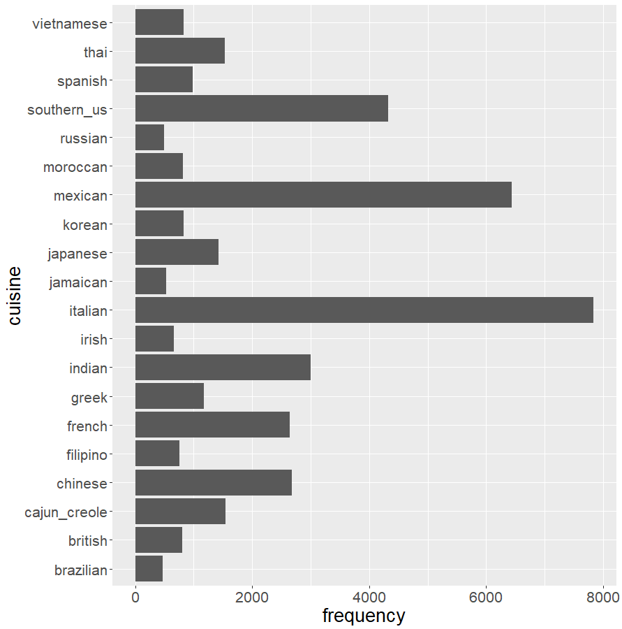
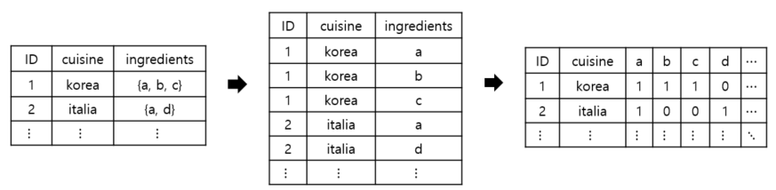
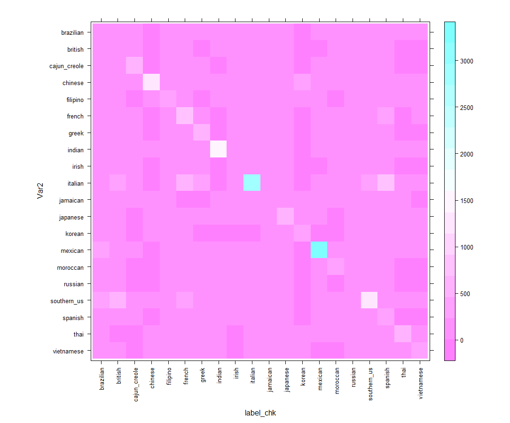

# What’s Cooking? - Kaggle data analysis

## 1. 데이터 소개

본 과제의 목표는 각 요리에 사용된 재료(ingredient)를 통해 해당 요리가 어느 문화권(지역)의 요리인지 분류하는 다항분류 문제입니다. 데이터는 kaggle에서 json파일 형태로 제공되고 있으며, R에서 해당 데이터를 불러오면, 39774개의 행과 3개의 열로 이루어진 데이터를 얻게 됩니다. 아래 표1 에서는 원시 데이터의 변수를 알아볼 수 있습니다. 반응변수로 사용되는 Cuisine변수는 총 20개의 범주를 가진 범주형 변수로, 각 범주의 빈도수는 그림1에서 확인할 수 있습니다. 

|**변수**|**설명**|
| :-: | :-: |
|ID|Recipe ID|
|Cuisine|Type of cuisine (response variable)|
|ingredients|List of ingredients|

표1. 변수 소개

그림1. 반응변수(cuisine) 범주 별 빈도수

## 2. 데이터 전처리

원시 데이터를 일반적인 Tabular 데이터 형태로 변환하기 위해서는 ingredients변수의 전처리가 필요합니다. 따라서 각각의 ID를 document로 보고 ingredients 변수 내부의 각 원소들을 term으로 보아 Document-Term 행렬 형태로 변환하였습니다. 우선 리스트 타입의 ingredients 변수를 풀어 long-format 형태의 데이터로 변환 후, 띄어쓰기 제거와 소문자로 통일 등의 텍스트 전처리를 했습니다. 이후 wide-format으로 데이터를 변형하여 원하는 형태의 데이터를 얻었습니다. 

그림2. 전처리 과정

학습데이터와 시험데이터의 분할은 과제 규정에 맞게 8:2로 수행하였습니다. 데이터의 특성을 확인하기 위해 학습데이터에서 각 ingredient가 몇 번 사용되었는지 알아본 결과, 일부 ingredient는 전혀 사용이 되지 않음을 확인했습니다. 요약 통계량을 살펴보니, 평균이 10이고 1사분위수는 3으로, 사용빈도가 굉장히 희소한 경우가 다수 존재했습니다. 이 같은 경우 분류 성능을 저해할 수 있다고 판단하여 1사분위수 기준으로 사용빈도가 희소한 ingredient변수를 제거했습니다. 

## 3. 파생변수 생성

초기에는 인접한 문화권(지역) 기준으로 군집분석을 통해 파생변수를 생성하려 하였으나, 모든 변수가 0과 1로 이루어진 이항변수라 흔히 사용되는 군집분석 방법을 적용하기에는 알맞지 않다고 생각했습니다. 다른 방법을 고려해본 결과, k-nearest neighborhood(k-NN)을 통해 파생변수를 만들었습니다. 우선 반응변수(cuisine)의 각 범주 별 ingredient 변수들의 평균을 범주의 중심점(centroid)으로 정의하였습니다. 이를 통해 0과 1 사이에 연속적인 값을 갖는 20개의 중심점 벡터를 생성하였고, 각 데이터와의 거리를 계산하여 가장 가까운 중심점의 범주로 파생변수를 생성했습니다. 이 단계에서 유의할 점은 중심점을 계산할 때, 시험데이터의 정보가 포함되지 않도록 학습데이터 내에서 계산을 해야 하는 것입니다. 중심점과의 거리를 계산할 때는 맨하탄 거리(Manhattan distance)와 유클리디안 거리(Euclidean distance)를 고려했는데, 유클리디안 거리의 성능이 더 좋아 이를 선택하여 적용했습니다. 성능 평가는 생성한 파생변수와 반응변수의 일치성을 기준으로 하였는데, 유클리디안 거리를 사용했을 때 학습데이터에서 약 49.8% 일치했습니다. 반응변수의 범주가 20개임을 고려하였을 때, 굉장히 높은 수치임을 알 수 있습니다. 

그림  3. 파생변수(cluster_id)와 반응변수(cuisine) 일치성에 대한 히트맵

## 4. 변수선택(Feature selection)

본 과제에서는 의사결정나무 기반의 앙상블 모형을 고려하였는데, 그 이유는 요리(cuisine)에 사용되는 재료(ingredient)들 사이에는 다양한 교호작용 효과가 있을 거라 생각했기 때문입니다. 변수선택은 보통 Elastic-net과 Recursive feature elimination(RFE) 방법을 사용하는데, 최종 모형을 의사결정나무 기반의 모형으로 정했기 때문에, 초기에는 랜덤 포레스트 기반의 RFE 방법을 적용했습니다. 하지만 연산시간이 너무 오래 걸려 차선책으로 변수중요도 기반의 변수선택을 고려하였습니다. R의 ranger 패키지는 permutation test를 통해 변수 중요도의 p-value를 함께 제공해주기 때문에 이 방법을 적용하였습니다. 유의수준 0.05를 기준으로 유의한 변수중요도를 갖는 변수들을 선택했습니다.

## 5. 모형 적합 및 결과

분석에 사용한 모형은 앞 절에서 설명하였듯이 의사결정나무 기반의 gradient boosting 계열의 모형을 사용했습니다. 

|**모형**|**max_depth**|**n_round**|**accuracy**|
| :-: | :-: | :-: | :-: |
|xgboost|25|300|74.34%|
|catboost|15|500|70.51%|

표2. 주요 파라미터 및 성능

